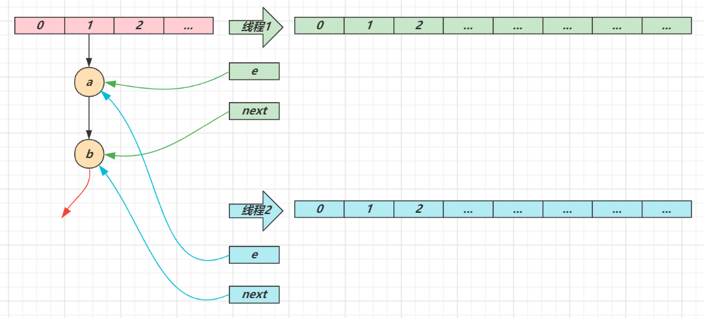
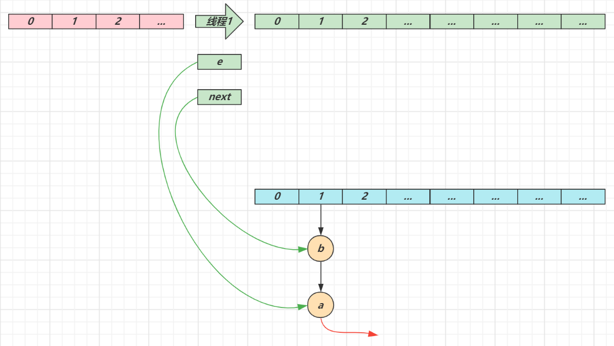
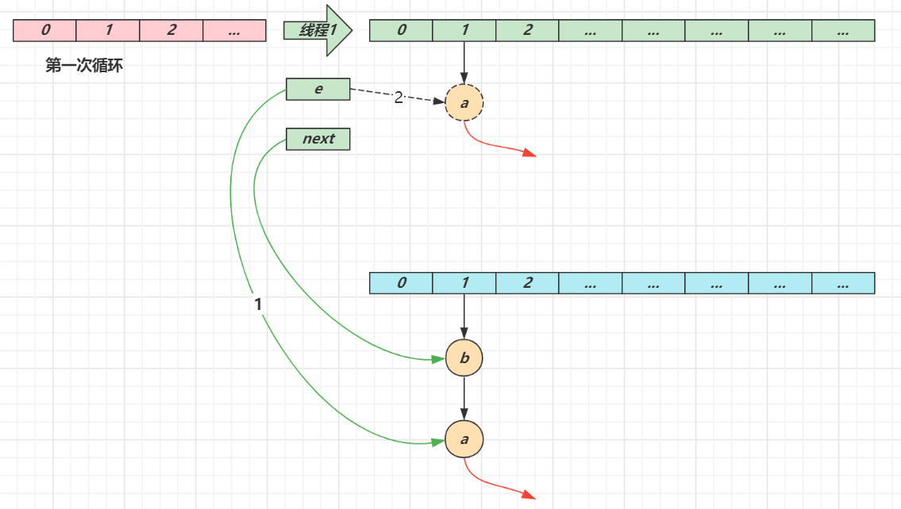
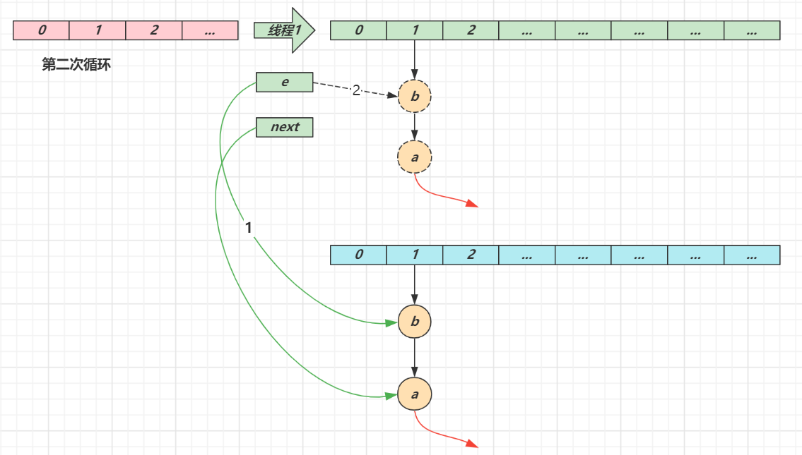
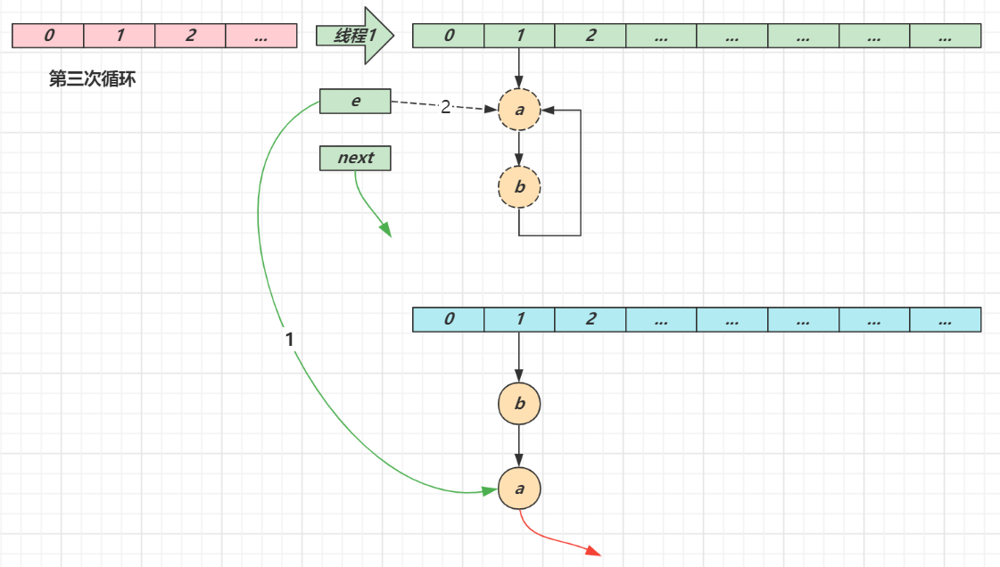

# 基础篇

> ***基础篇要点：算法、数据结构、基础设计模式***

## 1. 二分查找

**要求**

* 能够用自己语言描述二分查找算法
* 能够手写二分查找代码
* 能够解答一些变化后的考法

**算法描述**

1. 前提：有已排序数组 A（假设已经做好）

2. 定义左边界 L、右边界 R，确定搜索范围，循环执行二分查找（3、4两步）

3. 获取中间索引 M = Floor((L+R) /2)

4. 中间索引的值  A[M] 与待搜索的值 T 进行比较

   ① A[M] == T 表示找到，返回中间索引

   ② A[M] > T，中间值右侧的其它元素都大于 T，无需比较，中间索引左边去找，M - 1 设置为右边界，重新查找

   ③ A[M] < T，中间值左侧的其它元素都小于 T，无需比较，中间索引右边去找， M + 1 设置为左边界，重新查找

5. 当 L > R 时，表示没有找到，应结束循环

> *更形象的描述请参考：binary_search.html*

**算法实现**

```java
public static int binarySearch(int[] a, int t) {
    int l = 0, r = a.length - 1, m;
    while (l <= r) {
        m = (l + r) / 2;
        if (a[m] == t) {
            return m;
        } else if (a[m] > t) {
            r = m - 1;
        } else {
            l = m + 1;
        }
    }
    return -1;
}
```

**测试代码**

```java
public static void main(String[] args) {
    int[] array = {1, 5, 8, 11, 19, 22, 31, 35, 40, 45, 48, 49, 50};
    int target = 47;
    int idx = binarySearch(array, target);
    System.out.println(idx);
}
```

**解决整数溢出问题**

当 l 和 r 都较大时，`l + r` 有可能超过整数范围，造成运算错误，解决方法有两种：

```java
int m = l + (r - l) / 2;
```

还有一种是：

```java
int m = (l + r) >>> 1;
```

**其它考法**

1. 有一个有序表为 1,5,8,11,19,22,31,35,40,45,48,49,50 当二分查找值为 48 的结点时，查找成功需要比较的次数 

2. 使用二分法在序列 1,4,6,7,15,33,39,50,64,78,75,81,89,96 中查找元素 81 时，需要经过（   ）次比较

3. 在拥有128个元素的数组中二分查找一个数，需要比较的次数最多不超过多少次

对于前两个题目，记得一个简要判断口诀：奇数二分取中间，偶数二分取中间靠左。对于后一道题目，需要知道公式：

$$n = log_2N = log_{10}N/log_{10}2$$

其中 n 为查找次数，N 为元素个数


## 2. 冒泡排序

**要求**

* 能够用自己语言描述冒泡排序算法
* 能够手写冒泡排序代码
* 了解一些冒泡排序的优化手段

**算法描述**

1. 依次比较数组中相邻两个元素大小，若 a[j] > a[j+1]，则交换两个元素，两两都比较一遍称为一轮冒泡，结果是让最大的元素排至最后
2. 重复以上步骤，直到整个数组有序

> *更形象的描述请参考：bubble_sort.html*

**算法实现**

```java
public static void bubble(int[] a) {
    for (int j = 0; j < a.length - 1; j++) {
        // 一轮冒泡
        boolean swapped = false; // 是否发生了交换
        for (int i = 0; i < a.length - 1 - j; i++) {
            System.out.println("比较次数" + i);
            if (a[i] > a[i + 1]) {
                Utils.swap(a, i, i + 1);
                swapped = true;
            }
        }
        System.out.println("第" + j + "轮冒泡"
                           + Arrays.toString(a));
        if (!swapped) {
            break;
        }
    }
}
```

* 优化点1：每经过一轮冒泡，内层循环就可以减少一次
* 优化点2：如果某一轮冒泡没有发生交换，则表示所有数据有序，可以结束外层循环

**进一步优化**

```java
public static void bubble_v2(int[] a) {
    int n = a.length - 1;
    while (true) {
        int last = 0; // 表示最后一次交换索引位置
        for (int i = 0; i < n; i++) {
            System.out.println("比较次数" + i);
            if (a[i] > a[i + 1]) {
                Utils.swap(a, i, i + 1);
                last = i;
            }
        }
        n = last;
        System.out.println("第轮冒泡"
                           + Arrays.toString(a));
        if (n == 0) {
            break;
        }
    }
}
```

* 每轮冒泡时，最后一次交换索引可以作为下一轮冒泡的比较次数，如果这个值为零，表示整个数组有序，直接退出外层循环即可


## 3. 选择排序

**要求**

* 能够用自己语言描述选择排序算法
* 能够比较选择排序与冒泡排序
* 理解非稳定排序与稳定排序

**算法描述**

1. 将数组分为两个子集，排序的和未排序的，每一轮从未排序的子集中选出最小的元素，放入排序子集

2. 重复以上步骤，直到整个数组有序

> *更形象的描述请参考：selection_sort.html*

**算法实现**

```java
public static void selection(int[] a) {
    for (int i = 0; i < a.length - 1; i++) {
        // i 代表每轮选择最小元素要交换到的目标索引
        int s = i; // 代表最小元素的索引
        for (int j = s + 1; j < a.length; j++) {
            if (a[s] > a[j]) { // j 元素比 s 元素还要小, 更新 s
                s = j;
            }
        }
        if (s != i) {
            swap(a, s, i);
        }
        System.out.println(Arrays.toString(a));
    }
}
```

* 优化点：为减少交换次数，每一轮可以先找最小的索引，在每轮最后再交换元素

**与冒泡排序比较**

1. 二者平均时间复杂度都是 $O(n^2)$

2. 选择排序一般要快于冒泡，因为其交换次数少

3. 但如果集合有序度高，冒泡优于选择

4. 冒泡属于稳定排序算法，而选择属于不稳定排序
   * 稳定排序指，按对象中不同字段进行多次排序，不会打乱同值元素的顺序
   * 不稳定排序则反之

**稳定排序与不稳定排序**

```java
System.out.println("=================不稳定================");
Card[] cards = getStaticCards();
System.out.println(Arrays.toString(cards));
selection(cards, Comparator.comparingInt((Card a) -> a.sharpOrder).reversed());
System.out.println(Arrays.toString(cards));
selection(cards, Comparator.comparingInt((Card a) -> a.numberOrder).reversed());
System.out.println(Arrays.toString(cards));

System.out.println("=================稳定=================");
cards = getStaticCards();
System.out.println(Arrays.toString(cards));
bubble(cards, Comparator.comparingInt((Card a) -> a.sharpOrder).reversed());
System.out.println(Arrays.toString(cards));
bubble(cards, Comparator.comparingInt((Card a) -> a.numberOrder).reversed());
System.out.println(Arrays.toString(cards));
```

都是先按照花色排序（♠♥♣♦），再按照数字排序（AKQJ...）

* 不稳定排序算法按数字排序时，会打乱原本同值的花色顺序

  ```
  [[♠7], [♠2], [♠4], [♠5], [♥2], [♥5]]
  [[♠7], [♠5], [♥5], [♠4], [♥2], [♠2]]
  ```

  原来 ♠2 在前 ♥2 在后，按数字再排后，他俩的位置变了

* 稳定排序算法按数字排序时，会保留原本同值的花色顺序，如下所示 ♠2 与 ♥2 的相对位置不变

  ```
  [[♠7], [♠2], [♠4], [♠5], [♥2], [♥5]]
  [[♠7], [♠5], [♥5], [♠4], [♠2], [♥2]]
  ```

  


## 4. 插入排序

**要求**

* 能够用自己语言描述插入排序算法
* 能够比较插入排序与选择排序

**算法描述**

1. 将数组分为两个区域，排序区域和未排序区域，每一轮从未排序区域中取出第一个元素，插入到排序区域（需保证顺序）

2. 重复以上步骤，直到整个数组有序

> *更形象的描述请参考：insertion_sort.html*

**算法实现**

```java
// 修改了代码与希尔排序一致
public static void insert(int[] a) {
    // i 代表待插入元素的索引
    for (int i = 1; i < a.length; i++) {
        int t = a[i]; // 代表待插入的元素值
        int j = i;
        System.out.println(j);
        while (j >= 1) {
            if (t < a[j - 1]) { // j-1 是上一个元素索引，如果 > t，后移
                a[j] = a[j - 1];
                j--;
            } else { // 如果 j-1 已经 <= t, 则 j 就是插入位置
                break;
            }
        }
        a[j] = t;
        System.out.println(Arrays.toString(a) + " " + j);
    }
}
```

**与选择排序比较**

1. 二者平均时间复杂度都是 $O(n^2)$

2. 大部分情况下，插入都略优于选择

3. 有序集合插入的时间复杂度为 $O(n)$

4. 插入属于稳定排序算法，而选择属于不稳定排序

**提示**

> *插入排序通常被同学们所轻视，其实它的地位非常重要。小数据量排序，都会优先选择插入排序*


## 5. 希尔排序

**要求**

* 能够用自己语言描述希尔排序算法

**算法描述**

1. 首先选取一个间隙序列，如 (n/2，n/4 … 1)，n 为数组长度

2. 每一轮将间隙相等的元素视为一组，对组内元素进行插入排序，目的有二

   ① 少量元素插入排序速度很快

   ② 让组内值较大的元素更快地移动到后方

3. 当间隙逐渐减少，直至为 1 时，即可完成排序

> *更形象的描述请参考：shell_sort.html*

**算法实现**

```java
private static void shell(int[] a) {
    int n = a.length;
    for (int gap = n / 2; gap > 0; gap /= 2) {
        // i 代表待插入元素的索引
        for (int i = gap; i < n; i++) {
            int t = a[i]; // 代表待插入的元素值
            int j = i;
            while (j >= gap) {
                // 每次与上一个间隙为 gap 的元素进行插入排序
                if (t < a[j - gap]) { // j-gap 是上一个元素索引，如果 > t，后移
                    a[j] = a[j - gap];
                    j -= gap;
                } else { // 如果 j-1 已经 <= t, 则 j 就是插入位置
                    break;
                }
            }
            a[j] = t;
            System.out.println(Arrays.toString(a) + " gap:" + gap);
        }
    }
}
```

**参考资料**

* https://en.wikipedia.org/wiki/Shellsort


## 6. 快速排序

**要求**

* 能够用自己语言描述快速排序算法
* 掌握手写单边循环、双边循环代码之一
* 能够说明快排特点
* 了解洛穆托与霍尔两种分区方案的性能比较

**算法描述**

1. 每一轮排序选择一个基准点（pivot）进行分区
   1. 让小于基准点的元素的进入一个分区，大于基准点的元素的进入另一个分区
   2. 当分区完成时，基准点元素的位置就是其最终位置
2. 在子分区内重复以上过程，直至子分区元素个数少于等于 1，这体现的是分而治之的思想 （[divide-and-conquer](https://en.wikipedia.org/wiki/Divide-and-conquer_algorithm)）
3. 从以上描述可以看出，一个关键在于分区算法，常见的有洛穆托分区方案、双边循环分区方案、霍尔分区方案

> *更形象的描述请参考：quick_sort.html*


**单边循环快排（lomuto 洛穆托分区方案）**

1. 选择最右元素作为基准点元素

2. j 指针负责找到比基准点小的元素，一旦找到则与 i 进行交换

3. i 指针维护小于基准点元素的边界，也是每次交换的目标索引

4. 最后基准点与 i 交换，i 即为分区位置

```java
public static void quick(int[] a, int l, int h) {
    if (l >= h) {
        return;
    }
    int p = partition(a, l, h); // p 索引值
    quick(a, l, p - 1); // 左边分区的范围确定
    quick(a, p + 1, h); // 左边分区的范围确定
}

private static int partition(int[] a, int l, int h) {
    int pv = a[h]; // 基准点元素
    int i = l;
    for (int j = l; j < h; j++) {
        if (a[j] < pv) {
            if (i != j) {
                swap(a, i, j);
            }
            i++;
        }
    }
    if (i != h) {
        swap(a, h, i);
    }
    System.out.println(Arrays.toString(a) + " i=" + i);
    // 返回值代表了基准点元素所在的正确索引，用它确定下一轮分区的边界
    return i;
}
```


**双边循环快排（不完全等价于 hoare 霍尔分区方案）**

1. 选择最左元素作为基准点元素
2. j 指针负责从右向左找比基准点小的元素，i 指针负责从左向右找比基准点大的元素，一旦找到二者交换，直至 i，j 相交
3. 最后基准点与 i（此时 i 与 j 相等）交换，i 即为分区位置

要点

1. 基准点在左边，并且要先 j 后 i

2. while( **i** **< j** && a[j] > pv ) j-- 
3. while ( **i** **< j** && a[i] **<=** pv ) i++

```java
private static void quick(int[] a, int l, int h) {
    if (l >= h) {
        return;
    }
    int p = partition(a, l, h);
    quick(a, l, p - 1);
    quick(a, p + 1, h);
}

private static int partition(int[] a, int l, int h) {
    int pv = a[l];
    int i = l;
    int j = h;
    while (i < j) {
        // j 从右找小的
        while (i < j && a[j] > pv) {
            j--;
        }
        // i 从左找大的
        while (i < j && a[i] <= pv) {
            i++;
        }
        swap(a, i, j);
    }
    swap(a, l, j);
    System.out.println(Arrays.toString(a) + " j=" + j);
    return j;
}
```


**快排特点**

1. 平均时间复杂度是 $O(nlog_2⁡n )$，最坏时间复杂度 $O(n^2)$

2. 数据量较大时，优势非常明显

3. 属于不稳定排序

**洛穆托分区方案 vs 霍尔分区方案**

* 霍尔的移动次数平均来讲比洛穆托少3倍
* https://qastack.cn/cs/11458/quicksort-partitioning-hoare-vs-lomuto

> ***补充代码说明***
>
> * day01.sort.QuickSort3 演示了空穴法改进的双边快排，比较次数更少
> * day01.sort.QuickSortHoare 演示了霍尔分区的实现
> * day01.sort.LomutoVsHoare 对四种分区实现的移动次数比较


## 7. ArrayList

**要求**

* 掌握 ArrayList 扩容规则

**扩容规则**

1. ArrayList() 会使用长度为零的数组

2. ArrayList(int initialCapacity) 会使用指定容量的数组

3. public ArrayList(Collection<? extends E> c) 会使用 c 的大小作为数组容量

4. add(Object o) 首次扩容为 10，再次扩容为上次容量的 1.5 倍

5. addAll(Collection c) 没有元素时，扩容为 Math.max(10, 实际元素个数)，有元素时为 Math.max(原容量 1.5 倍, 实际元素个数)

其中第 4 点必须知道，其它几点视个人情况而定

**提示**

* 测试代码见 `day01.list.TestArrayList` ，这里不再列出
* 要**注意**的是，示例中用反射方式来更直观地反映 ArrayList 的扩容特征，但从 JDK 9 由于模块化的影响，对反射做了较多限制，需要在运行测试代码时添加 VM 参数 `--add-opens java.base/java.util=ALL-UNNAMED` 方能运行通过，后面的例子都有相同问题

> ***代码说明***
>
> * day01.list.TestArrayList#arrayListGrowRule 演示了 add(Object) 方法的扩容规则，输入参数 n 代表打印多少次扩容后的数组长度


## 8. Iterator

**要求**

* 掌握什么是 Fail-Fast、什么是 Fail-Safe

Fail-Fast 与 Fail-Safe

* ArrayList 是 fail-fast 的典型代表，遍历的同时不能修改，尽快失败

* CopyOnWriteArrayList 是 fail-safe 的典型代表，遍历的同时可以修改，原理是读写分离

**提示**

* 测试代码见 `day01.list.FailFastVsFailSafe`，这里不再列出


## 9. LinkedList

**要求**

* 能够说清楚 LinkedList 对比 ArrayList 的区别，并重视纠正部分错误的认知

**LinkedList**

1. 基于双向链表，无需连续内存
2. 随机访问慢（要沿着链表遍历）
3. 头尾插入删除性能高
4. 占用内存多

**ArrayList**

1. 基于数组，需要连续内存
2. 随机访问快（指根据下标访问）
3. 尾部插入、删除性能可以，其它部分插入、删除都会移动数据，因此性能会低
4. 可以利用 cpu 缓存，局部性原理

> ***代码说明***
>
> * day01.list.ArrayListVsLinkedList#randomAccess 对比随机访问性能
> * day01.list.ArrayListVsLinkedList#addMiddle 对比向中间插入性能
> * day01.list.ArrayListVsLinkedList#addFirst 对比头部插入性能
> * day01.list.ArrayListVsLinkedList#addLast 对比尾部插入性能
> * day01.list.ArrayListVsLinkedList#linkedListSize 打印一个 LinkedList 占用内存
> * day01.list.ArrayListVsLinkedList#arrayListSize 打印一个 ArrayList 占用内存


## 10. HashMap

**要求**

* 掌握 HashMap 的基本数据结构
* 掌握树化
* 理解索引计算方法、二次 hash 的意义、容量对索引计算的影响
* 掌握 put 流程、扩容、扩容因子
* 理解并发使用 HashMap 可能导致的问题
* 理解 key 的设计

### 1）基本数据结构

* 1.7 数组 + 链表
* 1.8 数组 + （链表 | 红黑树）

> 更形象的演示，见资料中的 hash-demo.jar，运行需要 jdk14 以上环境，进入 jar 包目录，执行下面命令
>
> ```
> java -jar --add-exports java.base/jdk.internal.misc=ALL-UNNAMED hash-demo.jar
> ```

### 2）树化与退化

**树化意义**

* 红黑树用来避免 DoS 攻击，防止链表超长时性能下降，树化应当是偶然情况，是保底策略
* hash 表的查找，更新的时间复杂度是 $O(1)$，而红黑树的查找，更新的时间复杂度是 $O(log_2⁡n )$，TreeNode 占用空间也比普通 Node 的大，如非必要，尽量还是使用链表
* hash 值如果足够随机，则在 hash 表内按泊松分布，在负载因子 0.75 的情况下，长度超过 8 的链表出现概率是 0.00000006，树化阈值选择 8 就是为了让树化几率足够小

**树化规则**

* 当链表长度超过树化阈值 8 时，先尝试扩容来减少链表长度，如果数组容量已经 >=64，才会进行树化

**退化规则**

* 情况1：在扩容时如果拆分树时，树元素个数 <= 6 则会退化链表
* 情况2：remove 树节点时，若 root、root.left、root.right、root.left.left 有一个为 null ，也会退化为链表

### 3）索引计算

**索引计算方法**

* 首先，计算对象的 hashCode()
* 再进行调用 HashMap 的 hash() 方法进行二次哈希
  * 二次 hash() 是为了综合高位数据，让哈希分布更为均匀
* 最后 & (capacity – 1) 得到索引

**数组容量为何是 2 的 n 次幂**

1. 计算索引时效率更高：如果是 2 的 n 次幂可以使用位与运算代替取模
2. 扩容时重新计算索引效率更高： hash & oldCap == 0 的元素留在原来位置 ，否则新位置 = 旧位置 + oldCap

**注意**

* 二次 hash 是为了配合 **容量是 2 的 n 次幂** 这一设计前提，如果 hash 表的容量不是 2 的 n 次幂，则不必二次 hash
* **容量是 2 的 n 次幂** 这一设计计算索引效率更好，但 hash 的分散性就不好，需要二次 hash 来作为补偿，没有采用这一设计的典型例子是 Hashtable

### 4）put 与扩容

**put 流程**

1. HashMap 是懒惰创建数组的，首次使用才创建数组
2. 计算索引（桶下标）
3. 如果桶下标还没人占用，创建 Node 占位返回
4. 如果桶下标已经有人占用
   1. 已经是 TreeNode 走红黑树的添加或更新逻辑
   2. 是普通 Node，走链表的添加或更新逻辑，如果链表长度超过树化阈值，走树化逻辑
5. 返回前检查容量是否超过阈值，一旦超过进行扩容

**1.7 与 1.8 的区别**

1. 链表插入节点时，1.7 是头插法，1.8 是尾插法

2. 1.7 是大于等于阈值且没有空位时才扩容，而 1.8 是大于阈值就扩容

3. 1.8 在扩容计算 Node 索引时，会优化

**扩容（加载）因子为何默认是 0.75f**

1. 在空间占用与查询时间之间取得较好的权衡
2. 大于这个值，空间节省了，但链表就会比较长影响性能
3. 小于这个值，冲突减少了，但扩容就会更频繁，空间占用也更多

### 5）并发问题

**扩容死链（1.7 会存在）**

1.7 源码如下：

```java
void transfer(Entry[] newTable, boolean rehash) {
    int newCapacity = newTable.length;
    for (Entry<K,V> e : table) {
        while(null != e) {
            Entry<K,V> next = e.next;
            if (rehash) {
                e.hash = null == e.key ? 0 : hash(e.key);
            }
            int i = indexFor(e.hash, newCapacity);
            e.next = newTable[i];
            newTable[i] = e;
            e = next;
        }
    }
}
```

* e 和 next 都是局部变量，用来指向当前节点和下一个节点
* 线程1（绿色）的临时变量 e 和 next 刚引用了这俩节点，还未来得及移动节点，发生了线程切换，由线程2（蓝色）完成扩容和迁移



* 线程2 扩容完成，由于头插法，链表顺序颠倒。但线程1 的临时变量 e 和 next 还引用了这俩节点，还要再来一遍迁移



* 第一次循环
  * 循环接着线程切换前运行，注意此时 e 指向的是节点 a，next 指向的是节点 b
  * e 头插 a 节点，注意图中画了两份 a 节点，但事实上只有一个（为了不让箭头特别乱画了两份）
  * 当循环结束是 e 会指向 next 也就是 b 节点



* 第二次循环
  * next 指向了节点 a
  * e 头插节点 b
  * 当循环结束时，e 指向 next 也就是节点 a



* 第三次循环
  * next 指向了 null
  * e 头插节点 a，**a 的 next 指向了 b**（之前 a.next 一直是 null），b 的 next 指向 a，死链已成
  * 当循环结束时，e 指向 next 也就是 null，因此第四次循环时会正常退出



**数据错乱（1.7，1.8 都会存在）**

* 代码参考 `day01.map.HashMapMissData`，具体调试步骤参考视频

> ***补充代码说明***
>
> * day01.map.HashMapDistribution 演示 map 中链表长度符合泊松分布
> * day01.map.DistributionAffectedByCapacity 演示容量及 hashCode 取值对分布的影响
>   * day01.map.DistributionAffectedByCapacity#hashtableGrowRule 演示了 Hashtable 的扩容规律
>   * day01.sort.Utils#randomArray 如果 hashCode 足够随机，容量是否是 2 的 n 次幂影响不大
>   * day01.sort.Utils#lowSameArray 如果 hashCode 低位一样的多，容量是 2 的 n 次幂会导致分布不均匀
>   * day01.sort.Utils#evenArray 如果 hashCode 偶数的多，容量是 2 的 n 次幂会导致分布不均匀
>   * 由此得出对于容量是 2 的 n 次幂的设计来讲，二次 hash 非常重要
> * day01.map.HashMapVsHashtable 演示了对于同样数量的单词字符串放入 HashMap 和 Hashtable 分布上的区别


### 6）key 的设计

**key 的设计要求**

1. HashMap 的 key 可以为 null，但 Map 的其他实现则不然
2. 作为 key 的对象，必须实现 hashCode 和 equals，并且 key 的内容不能修改（不可变）
3. key 的 hashCode 应该有良好的散列性

如果 key 可变，例如修改了 age 会导致再次查询时查询不到

```java
public class HashMapMutableKey {
    public static void main(String[] args) {
        HashMap<Student, Object> map = new HashMap<>();
        Student stu = new Student("张三", 18);
        map.put(stu, new Object());

        System.out.println(map.get(stu));

        stu.age = 19;
        System.out.println(map.get(stu));
    }

    static class Student {
        String name;
        int age;

        public Student(String name, int age) {
            this.name = name;
            this.age = age;
        }

        public String getName() {
            return name;
        }

        public void setName(String name) {
            this.name = name;
        }

        public int getAge() {
            return age;
        }

        public void setAge(int age) {
            this.age = age;
        }

        @Override
        public boolean equals(Object o) {
            if (this == o) return true;
            if (o == null || getClass() != o.getClass()) return false;
            Student student = (Student) o;
            return age == student.age && Objects.equals(name, student.name);
        }

        @Override
        public int hashCode() {
            return Objects.hash(name, age);
        }
    }
}
```


**String 对象的 hashCode() 设计**

* 目标是达到较为均匀的散列效果，每个字符串的 hashCode 足够独特
* 字符串中的每个字符都可以表现为一个数字，称为 $S_i$，其中 i 的范围是 0 ~ n - 1 
* 散列公式为： $S_0∗31^{(n-1)}+ S_1∗31^{(n-2)}+ … S_i ∗ 31^{(n-1-i)}+ …S_{(n-1)}∗31^0$
* 31 代入公式有较好的散列特性，并且 31 * h 可以被优化为 
  * 即 $32 ∗h -h $
  * 即 $2^5  ∗h -h$
  * 即 $h≪5  -h$


## 11. 单例模式

**要求**

* 掌握五种单例模式的实现方式
* 理解为何 DCL 实现时要使用 volatile 修饰静态变量
* 了解 jdk 中用到单例的场景

**饿汉式**

```java
public class Singleton1 implements Serializable {
    private Singleton1() {
        if (INSTANCE != null) {
            throw new RuntimeException("单例对象不能重复创建");
        }
        System.out.println("private Singleton1()");
    }

    private static final Singleton1 INSTANCE = new Singleton1();

    public static Singleton1 getInstance() {
        return INSTANCE;
    }

    public static void otherMethod() {
        System.out.println("otherMethod()");
    }

    public Object readResolve() {
        return INSTANCE;
    }
}
```

* 构造方法抛出异常是防止反射破坏单例
* `readResolve()` 是防止反序列化破坏单例


**枚举饿汉式**

```java
public enum Singleton2 {
    INSTANCE;

    private Singleton2() {
        System.out.println("private Singleton2()");
    }

    @Override
    public String toString() {
        return getClass().getName() + "@" + Integer.toHexString(hashCode());
    }

    public static Singleton2 getInstance() {
        return INSTANCE;
    }

    public static void otherMethod() {
        System.out.println("otherMethod()");
    }
}
```

* 枚举饿汉式能天然防止反射、反序列化破坏单例


**懒汉式**

```java
public class Singleton3 implements Serializable {
    private Singleton3() {
        System.out.println("private Singleton3()");
    }

    private static Singleton3 INSTANCE = null;

    // Singleton3.class
    public static synchronized Singleton3 getInstance() {
        if (INSTANCE == null) {
            INSTANCE = new Singleton3();
        }
        return INSTANCE;
    }

    public static void otherMethod() {
        System.out.println("otherMethod()");
    }

}
```

* 其实只有首次创建单例对象时才需要同步，但该代码实际上每次调用都会同步
* 因此有了下面的双检锁改进


**双检锁懒汉式**

```java
public class Singleton4 implements Serializable {
    private Singleton4() {
        System.out.println("private Singleton4()");
    }

    private static volatile Singleton4 INSTANCE = null; // 可见性，有序性

    public static Singleton4 getInstance() {
        if (INSTANCE == null) {
            synchronized (Singleton4.class) {
                if (INSTANCE == null) {
                    INSTANCE = new Singleton4();
                }
            }
        }
        return INSTANCE;
    }

    public static void otherMethod() {
        System.out.println("otherMethod()");
    }
}
```

为何必须加 volatile：

* `INSTANCE = new Singleton4()` 不是原子的，分成 3 步：创建对象、调用构造、给静态变量赋值，其中后两步可能被指令重排序优化，变成先赋值、再调用构造
* 如果线程1 先执行了赋值，线程2 执行到第一个 `INSTANCE == null` 时发现 INSTANCE 已经不为 null，此时就会返回一个未完全构造的对象


**内部类懒汉式**

```java
public class Singleton5 implements Serializable {
    private Singleton5() {
        System.out.println("private Singleton5()");
    }

    private static class Holder {
        static Singleton5 INSTANCE = new Singleton5();
    }

    public static Singleton5 getInstance() {
        return Holder.INSTANCE;
    }

    public static void otherMethod() {
        System.out.println("otherMethod()");
    }
}
```

* 避免了双检锁的缺点


**JDK 中单例的体现**

* Runtime 体现了饿汉式单例
* Console 体现了双检锁懒汉式单例
* Collections 中的 EmptyNavigableSet 内部类懒汉式单例
* ReverseComparator.REVERSE_ORDER 内部类懒汉式单例
* Comparators.NaturalOrderComparator.INSTANCE 枚举饿汉式单例
